<div align="center">



*if it's not in the CRM, it didn't happen*

   

   

</div>

> I build the decision systems revenue teams run on. Six internal roles, IC to Director, in eight years at Trend Micro. **On the side, I ship software:** local AI, agents, and the tools I wanted my sellers to have.

```yaml
# mike.yaml
role:     revops & analytics leader · sales development · ex-Trend Micro
based:    dallas, tx · remote-friendly
focus:    [ pipeline & forecast inspection, MEDDPICC, BI & exec reporting, applied LLMs ]
current:  [ trajecktory: an AI job-search command center, a DGX Spark running local models ]
```

## What I'm building

| Open source | Local lab |
|:--|:--|
| [**trajecktory**](https://github.com/michaelinghilterra-creator/trajecktory): run a whole job search from one local AI dashboard. Scores postings, tailors a resume in 3 minutes instead of 2 hours, keeps every follow-up alive. 160+ releases. | **Inference box**: an NVIDIA DGX Spark serving an open-weight MoE model on vLLM, 262K context, speculative decoding. A new model only gets the box if it beats the incumbent on my own rubric: five challengers so far, zero wins. |
| [**outreach-grader**](https://github.com/michaelinghilterra-creator/outreach-grader): paste a cold email or LinkedIn message, get a score on 8 dimensions and a rewrite. | **Private agent**: an iMessage assistant running on the local model. |
| [**ai-text-hygiene**](https://github.com/michaelinghilterra-creator/ai-text-hygiene): strip invisible Unicode and AI tells down to plain, ATS-safe text. Zero dependencies. | **Nightly sourcing**: four runs a day that scan job boards, pre-filter on the local model, score, and brief me. |

`local != cloud`: the lab runs on hardware I own, so the data never leaves the house.

## How I work

- **Measure before you trust.** Published benchmarks are not your workload. Forecasts are not bookings.
- **Human in the loop.** Automation drafts; a person approves anything that reaches a customer.
- **Ship small, ship often.** Reporting went from 10 days to 36 hours the same way software does: one release at a time.

## Contact

[michaelinghilterra.com](https://michaelinghilterra.com) · [LinkedIn](https://www.linkedin.com/in/michaelinghilterra/) · open to senior RevOps, analytics, and sales development leadership roles
